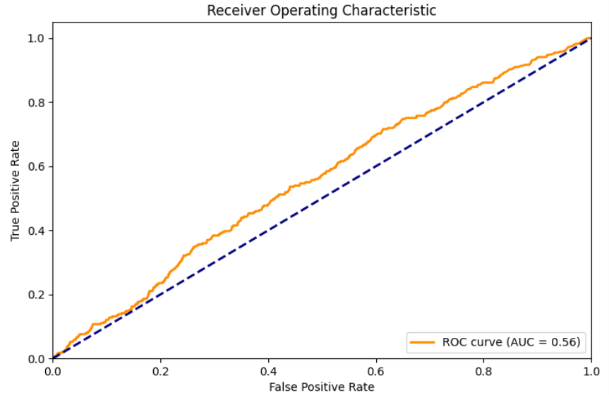
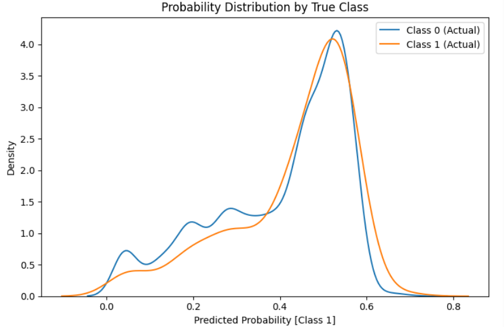
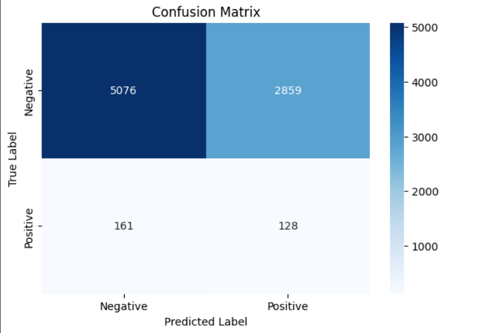
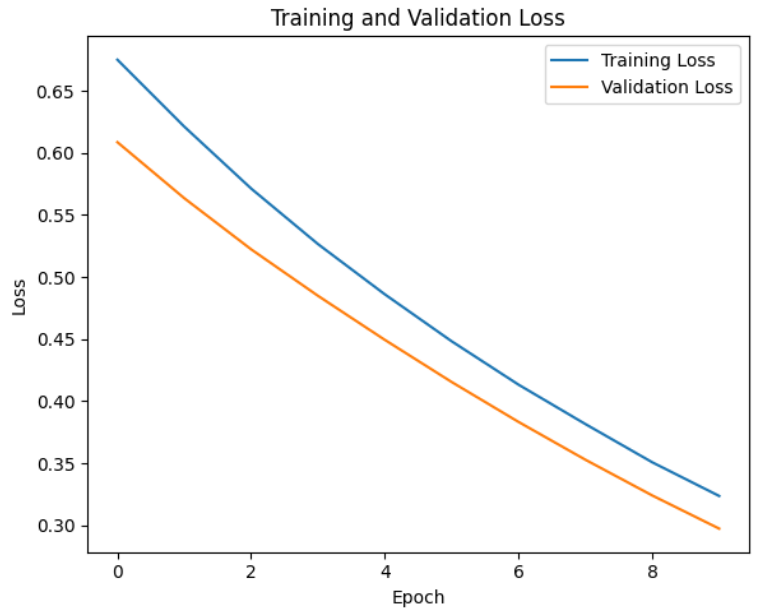
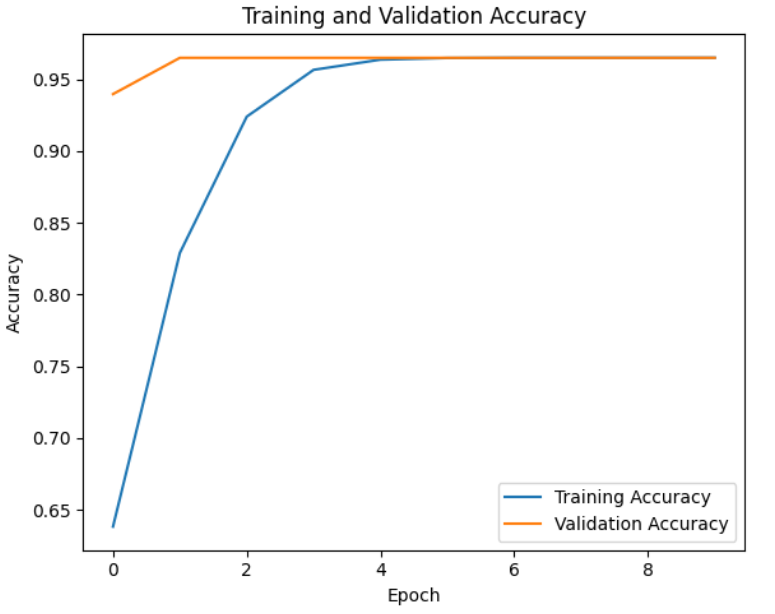
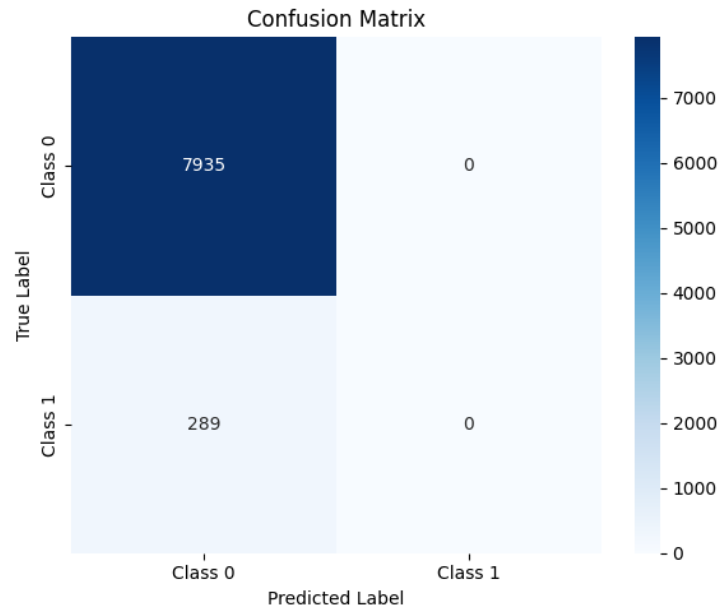

# Molecular Graph Representation and Classification 

This repository provides the source code for fine tuning pretrained Graph Neural Network (GraphMVP) for __molecular 
classification__ and utilizes Variational Autoencoder to __generate novel molecules__ from SMILES strings. The goal is to
apply deep learning for drug discovery; we predict β-secretase (BACE1) inhibitor activity (classification) and explore 
new compound structures (generation). The classification task helps identify potential drug candidates, while the
generative model allows de novo design of novel molecules. Screening vast chemical libraries is quite expensive, and
AI offers cost-effective way to explore existing and even propose new molecules, learning patters unseen by humans.

The model was first tested on the HIV database consisted of 41127 SMILES strings which were labeled as *HIV active* (class 1) or *HIV inactive* (class 0).
The dataset is very imbalanced, with 39684 of the instances being in class **0** while only 1443 are labeled **1**. The steps for training the model on hiv.csv dataset are listed in the src/classification/hiv_classification folder.

## Attention

This project adapts and uses code from [Shengchao Liu's repository] (https://github.com/chao1224/GraphMVP), which is licensed under the MIT License. List of references can be found in text file in src file

# Problem Definition and Motivation

**Molecular Classification** - We aim to predict whether a given molecule inhibits human β-secretase 1 (BACE1), a key enzyme in Alzheimer’s disease plaque formation. Accurate classification models are important because they can prioritize lead compounds and reduce wet-lab 
costs. The BACE dataset contains 1,513 compounds with binary activity labels (active/inactive). A major challenge is that chemical space is
enormous (∼10^60 possible drug-like molecules), so learning from limited examples is hard. 

**Molecular Generation** - We decided to use a variational autoencoder to map discrete molecules (SMILES strings) into a continuous "chemical" latent space. In this space, we can interpolate and optimize to generate new compounds. Continuous latent representations
make it possible to apply gradient-based search over chemical space. Architecture of variational autoencoder makes it possible
to propose novel molecules not seen in training data that follow molecular features

Molecules are natural graphs (atoms represent nodes, atomic bonds edges) and because of that, Graph Neural Network excel at capturing molecular structure by learning local atom-bond interactions. Specifically, GraphMVP leverages multi-view self-supervision to infuse 3D structural knowledge into a 2D GNN encoder, resulting in a powerful feature extractor for downstream tasks. On the other side, VAEs are superior compared to traditional methods for searching in discrete chemical space, because they learn a continuous embedding of molecules.

# Usage Instructions

To gain more comprehensive understanding of GraphMVP, reader should visit their repository, listed above. There you can find detailed instructions on how to set up environment to work with this model. Nevertheless, we will leave here basic instructions:

### Environment Setup

- Install Anaconda or Miniconda
- Create a new Python 3.8+ environment and install dependencies:
  ```bash
    conda create -n chem_project python=3.8
    conda activate chem_project
    conda install pytorch torchvision cudatoolkit=11.3 -c pytorch
    conda install -c conda-forge rdkit
    pip install torch-geometric==1.7.2
    pip install -r requirements.txt
    ```
- Clone repository and merge with GraphMVP

# Results

## BACE Classification

**Results without weights:**
|EPOCH   | TRAIN LOSS | VAL ACCURACY |
|--------|------------|--------------|
| 1	| 0.7033	| 0.5400|
| 2	| 0.6672	| 0.6814|
| 3	| 0.6545	| 0.6703|
| 4	| 0.6363	| 0.6063|
| 5	| 0.6324	| 0.6795|
| 6	| 0.6239	| 0.7183|
| 7	| 0.6120	| 0.7023|
| 8	| 0.6077	| 0.7215|
| 9	| 0.5993	| 0.7142|
| 10 | 0.5926	| 0.7263|  
Test accuracy: 0.7867

**Results with weights:**
|EPOCH   | TRAIN LOSS | VAL ACCURACY |
|--------|------------|--------------|
| 1 | 0.7158 | 0.5275|
| 2 | 0.6743 | 0.5581|
| 3 | 0.6252 | 0.5308|
| 4 | 0.6122 | 0.5517|
| 5 |  0.5812 | 0.6021|
| 6 | 0.5855 | 0.5932|
| 7 |  0.5556 | 0.5845|
| 8 |  0.5689 | 0.5680|
| 9 | 0.5570 |  0.7085|
| 10 | 0.5533 | 0.7139|  
Test accuracy: 0.8446

## HIV Classification

As described in the README in src/classification/hiv-classification, HIV database is trained on 2 classification task: random forest classifier and a simple neural network.

### Random Forest Classifier



AUC = 0.55 - Random guessing would yield an AUC of 0.5 (diagonal line).

The model's performance (0.55) is just 5% better than random chance, indicating very weak discriminatory power.

Shape of the ROC Curve - The curve appears close to the diagonal (random classifier), with no significant "hump" toward the top-left corner (which would indicate strong performance). The slight deviation from the diagonal suggests minimal predictive capability.



Key Elements:
1. X-axis (Predicted Probability [Class 1]):
 - Shows the model's confidence scores (0 to 1) that a sample belongs to Class 1
 - 0 = Definitely Class 0
 - 1 = Definitely Class 1
 - 0.5 = Unsure

2. Y-axis (Density):
 - Shows how frequently each probability occurs
 - Higher peaks = more samples with those probabilities

3. Color-coded Curves:
 - Blue (Class 0): Actual negative cases
 - Orange (Class 1): Actual positive cases

The plot shows:
- Partial Separation: some overlap in the middle (around 0.2-0.8) means the model struggles with some cases. The "hump" around 0.5 suggests uncertain predictions
Class Performance:
 - Class 1 (orange) has a wider spread, indicating that some true positives are correctly predicted with high probability (>0.6), but many are predicted with medium probability (~0.3-0.7)
 - Class 0 (blue) shows a concentration near 0 (good) but a long tail toward higher probabilities (false positives)



This confusion matrix shows that more than 1/3 of the inactive HIV instances are incorrectly classified as well as the Random Forest having difficulties classifying  HIV active instances at all. However, it was easily anticipated that the active instances would ose a problem due to the imbalance in the dataset.

Final Random Forest Classifier Report:
|              |precision  |  recall | f1-score |  support|
|--------------|-----------|----------|---------|----------|
|    Negative   |    0.97   |   0.64   |   0.77  |    7935|
|    Positive   |    0.04    |  0.44   |   0.08  |     289|
|    accuracy   |            |         |   0.63  |    8224|
|   macro avg    |   0.51   |   0.54   |   0.42   |   8224|
|weighted avg    |   0.94   |   0.63   |   0.75   |   8224|

### Neural Network Classifier



The parallel decrease suggests no severe overfitting. Small gap between curves means good generalization. Final losses: Training (~0.30) vs Validation (~0.35).

The small divergence after epoch 6 suggests validation loss plateaus while training loss decreases.



Strong Final Performance: Training accuracy reaches ~0.95; Validation accuracy peaks ~0.85-0.90. Both curves show steady improvement

Healthy Learning Pattern: Parallel upward trends indicate proper learning. Small gap between curves suggests good generalization. No signs of severe overfitting

Potential Saturation: Validation accuracy begins plateauing around epoch 4. Training accuracy continues improving slightly



The Neural Network predicts inactive instances perfectly, while it completely fails on active ones.

# Conclusion

In this project, we created a dual-model pipeline for drug discovery, including a fine-tuned GraphMVP GNN that achieves strong classification accuracy on the BACE inhibitor dataset, leveraging pre-trained 3D-enhanced embeddings and a SMILES-based VAE that is supposed to generate diverse, valid molecules by exploring the learned latent space.

Even though we failed to create accurate models, we set up basis for meaningful models that can possibly lead drug discovery process in the future, for which a lot of time, knowledge and resources is needed.

There are many extensions possible. We could incorporate multi-task learning or additional properties (solubility, toxicity) into GraphMVP fine-tuning. For the VAE, we could experiment with graph-based decoders (like JT-VAE) to improve validity. Conditional generation (e.g. target-specific VAEs) or integrating a property predictor into training could direct the search toward more potent inhibitors.

However, for now, we conclude that we successfully demonstrated how GNNs and VAEs can be used in future drug discovery, but more generally, in progress of Artificial Intelligence.
